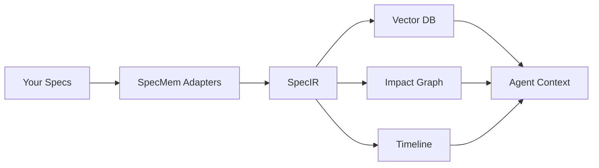

# 🚀 Getting Started

Welcome to SpecMem! This guide will help you get up and running quickly.

## What is SpecMem?

SpecMem is a **cognitive memory layer** for AI coding agents. It provides:

- **Persistent memory** across agent sessions
- **Spec awareness** for code changes
- **Intelligent context** management
- **Selective testing** recommendations

## Quick Overview

## Next Steps

  

    <h3>📦 Installation</h3>
    
Install SpecMem and its dependencies.

    <a href="installation/" class="md-button">Install Now →</a>
  

  

    <h3>⚡ Quick Start</h3>
    
Get up and running in 5 minutes.

    <a href="quickstart/" class="md-button">Quick Start →</a>
  

  

    <h3>🔧 Configuration</h3>
    
Customize SpecMem for your project.

    <a href="configuration/" class="md-button">Configure →</a>
  

## Requirements

- **Python 3.11+**
- **pip** or **uv** package manager
- A project with specification files (Kiro, Cursor, Claude, etc.)

## Supported Platforms

| Platform | Status |
|----------|--------|
| macOS | ✅ Fully supported |
| Linux | ✅ Fully supported |
| Windows | ✅ Fully supported |
| Docker | ✅ Fully supported |
