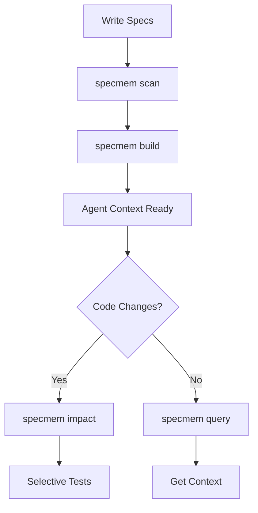

# 📚 User Guide

Learn how to use SpecMem effectively in your projects.

## Overview

SpecMem provides a comprehensive toolkit for managing specifications and context for AI coding agents. This guide covers all major features.

## Core Features

  

    <h3>🧠 Core Concepts</h3>
    
Understand SpecIR, memory types, and the architecture.

    <a href="concepts/" class="md-button">Learn →</a>
  

  

    <h3>🔌 Adapters</h3>
    
Parse specs from Kiro, Cursor, Claude, and more.

    <a href="adapters/" class="md-button">Explore →</a>
  

  

    <h3>📊 SpecImpact Graph</h3>
    
Understand relationships between specs, code, and tests.

    <a href="specimpact/" class="md-button">Discover →</a>
  

  

    <h3>⏱️ SpecDiff Timeline</h3>
    
Track spec evolution and detect drift over time.

    <a href="specdiff/" class="md-button">Track →</a>
  

  

    <h3>✅ SpecValidator</h3>
    
Ensure specification quality and consistency.

    <a href="validator/" class="md-button">Validate →</a>
  

  

    <h3>🎯 Selective Testing</h3>
    
Run only the tests that matter for your changes.

    <a href="selective-testing/" class="md-button">Optimize →</a>
  

## Workflow

## Best Practices

!!! tip "Keep Specs Updated"
    Run `specmem scan` after updating specifications to keep the index fresh.

!!! tip "Use Impact Analysis"
    Before committing, run `specmem impact` to understand the scope of your changes.

!!! tip "Validate Regularly"
    Run `specmem validate` in CI to catch spec issues early.

!!! tip "Leverage the Web UI"
    Use `specmem serve` for visual exploration of your spec graph.
