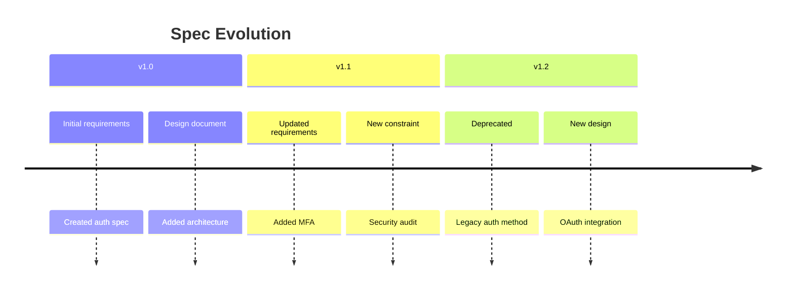

# ⏱️ SpecDiff Timeline

SpecDiff tracks specification changes over time, enabling drift detection and historical analysis.

## Overview

SpecDiff maintains a timeline of all specification changes:



## Tracking Changes

### Automatic Tracking

SpecDiff automatically tracks changes when you run:

```bash
specmem scan
```

Each scan creates a snapshot that's compared to the previous state.

### Manual Snapshot

Create a named snapshot:

```bash
specmem diff snapshot --name "v1.0-release"
```

## Viewing History

### CLI

```bash
# View recent changes
specmem diff history

# View changes for a specific spec
specmem diff history --spec auth/requirements.md

# View changes in date range
specmem diff history --since 2025-01-01 --until 2025-01-31

# Detailed diff
specmem diff show --spec auth/requirements.md --from v1.0 --to v1.1
```

### Python API

```python
from specmem import SpecMemClient

sm = SpecMemClient()

# Get history for a spec
history = sm.get_spec_history("auth/requirements.md")
for entry in history:
    print(f"{entry.timestamp}: {entry.change_type}")
    print(f"  Summary: {entry.summary}")

# Compare versions
diff = sm.compare_specs(
    spec="auth/requirements.md",
    from_version="v1.0",
    to_version="v1.1"
)
print(diff.added)
print(diff.removed)
print(diff.modified)
```

## Drift Detection

Detect when specs become stale or inconsistent:

```bash
specmem diff drift
```

Output:

```
🔍 Drift Analysis

⚠️  Stale Specs (no updates in 90+ days):
   • legacy/old-feature.md (last updated: 2024-09-15)
   • deprecated/v1-api.md (last updated: 2024-08-20)

⚠️  Orphaned Specs (no code references):
   • features/unused-feature.md
   • designs/abandoned-design.md

⚠️  Contradictions Detected:
   • auth/requirements.md vs security/constraints.md
     Line 45: "passwords must be 8+ chars"
     Line 12: "passwords must be 12+ chars"
```

### Python API

```python
# Get drift report
drift = sm.get_drift_report()

print(f"Stale specs: {len(drift.stale)}")
print(f"Orphaned specs: {len(drift.orphaned)}")
print(f"Contradictions: {len(drift.contradictions)}")

for contradiction in drift.contradictions:
    print(f"Conflict: {contradiction.spec_a} vs {contradiction.spec_b}")
    print(f"  {contradiction.description}")
```

## Deprecation Management

### Mark as Deprecated

```bash
specmem diff deprecate --spec legacy/old-feature.md --reason "Replaced by new-feature"
```

### Python API

```python
# Deprecate a spec
sm.deprecate_spec(
    "legacy/old-feature.md",
    reason="Replaced by new-feature",
    replacement="features/new-feature.md"
)

# Get deprecated specs
deprecated = sm.get_deprecated_specs()
for spec in deprecated:
    print(f"{spec.path}: {spec.deprecation_reason}")
    if spec.replacement:
        print(f"  Replaced by: {spec.replacement}")
```

## Timeline Queries

### Find When Something Changed

```python
# When was a requirement added?
events = sm.find_events(
    spec="auth/requirements.md",
    content_contains="MFA"
)
for event in events:
    print(f"MFA mentioned: {event.timestamp}")

# What changed between releases?
changes = sm.get_changes_between(
    from_tag="v1.0",
    to_tag="v2.0"
)
```

### Blame

Find who/when a specific line was added:

```bash
specmem diff blame --spec auth/requirements.md --line 45
```

## Contradiction Detection

SpecDiff can detect contradictions between specs:

```python
# Check for contradictions
contradictions = sm.find_contradictions()

for c in contradictions:
    print(f"Contradiction between:")
    print(f"  {c.spec_a.path}:{c.line_a}")
    print(f"  {c.spec_b.path}:{c.line_b}")
    print(f"  Issue: {c.description}")
```

### Common Contradiction Types

| Type | Example |
|------|---------|
| Numeric conflict | "8 char password" vs "12 char password" |
| Boolean conflict | "feature enabled" vs "feature disabled" |
| Temporal conflict | "sync processing" vs "async processing" |
| Scope conflict | "all users" vs "premium users only" |

## Export Timeline

```bash
# Export as JSON
specmem diff export --format json > timeline.json

# Export as CSV
specmem diff export --format csv > timeline.csv

# Export as Markdown
specmem diff export --format markdown > CHANGELOG.md
```

## Configuration

```toml
[specdiff]
# How long before a spec is considered stale
stale_threshold_days = 90

# Enable automatic contradiction detection
detect_contradictions = true

# Keep history for this many days
retention_days = 365

# Snapshot on every scan
auto_snapshot = true
```
